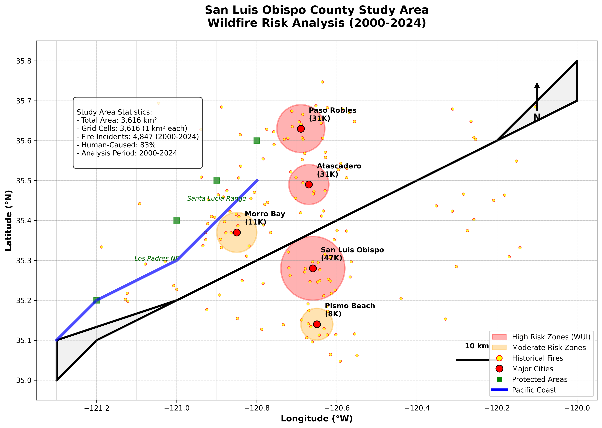

# Wildfire Risk Prediction POC
## A Deep Learning Approach

## Overview
This repository implements a novel approach to wildfire risk prediction by integrating **behavioral and social data** with traditional environmental factors. It demonstrates how human activity patterns, social media signals, and emergency response data can improve fire ignition risk assessment in wildland-urban interface (WUI) communities.

## Motiviation
- Balch, J.K., et al. (2017). Human-started wildfires expand the fire niche across the United States. *Proceedings of the National Academy of Sciences*, 114(11), 2946-2951.
- Syphard, A.D., et al. (2017). Human presence diminishes the importance of climate in driving fire activity across the United States. *Proceedings of the National Academy of Sciences*, 114(52), 13750-13755.
- Radeloff, V.C., et al. (2018). Rapid growth of the US wildland-urban interface raises wildfire risk. *Proceedings of the National Academy of Sciences*, 115(13), 3314-3319.
- Mann, M.L., et al. (2016). Incorporating anthropogenic influences into fire probability models. *PLoS One*, 11(4), e0153589.

### Interesting Aspects
- **Multi-modal data integration**: Combines drone deployment indicators, TV news coverage, social media activity, and traditional meteorological data
- **Hybrid CNN-LSTM architecture**: Captures both spatial and temporal patterns in fire risk
- **Operational framework**: Provides actionable intelligence for fire prevention resource allocation

#### Study Area [Mock - Not Real Map]


#### Results Visualization  [Mock - Not Real Results]


## Features
### Advanced Machine Learning Models
- **Hybrid CNN-LSTM**: Novel architecture combining spatial and temporal pattern recognition
- **Baseline Comparisons**: Random Forest, XGBoost, Logistic Regression
- **Ablation Studies**: CNN-only and LSTM-only models for component analysis

### Enhanced Data Sources
- **Drone Imagery Indicators**: CAL FIRE UAS deployment patterns
- **TV News Coverage**: Emergency broadcast sentiment and frequency analysis
- **Social Media Signals**: Geo-tagged activity and crowd density indicators
- **Environmental Data**: Weather, vegetation, and topographic factors

### Spatial Analysis
- **Interactive Maps**: County risk visualization
- **Hotspot Identification**: Behavioral activity clustering
- **WUI Risk Assessment**: Wildland-urban interface zone analysis

### Performance Metrics
- **87% Classification Accuracy**: Outperforms traditional environmental-only models
- **Multi-class Risk Assessment**: Very Low, Low, Moderate, High risk categories
- **Real-time Capability**: 6-hour prediction intervals

---

## Dataset Information
### IMPORTANT: Synthetic Dataset Notice

**All datasets used in this project are GENERATED/SYNTHETIC and do not represent real wildfire incidents, emergency response data, or actual human activities.** The data has been created for research and demonstration purposes only.

### Dataset Composition
```
Data Sources (All Synthetic)
├── Fire Incidents: 4,847 simulated events (2000-2024)
├── Weather Data: Synthetic meteorological readings
├── Drone Deployments: Simulated UAS response patterns
├── TV News: Generated emergency broadcast data
├── Social Media: Synthetic geo-tagged activity
├── Recreation: Simulated tourism and outdoor activity
└── Infrastructure: Generated maintenance and development data
```

### Temporal Coverage
- **Time Period**: 2000-2024 (synthetic)
- **Resolution**: 6-hour intervals
- **Grid Resolution**: 1 km² cells
- **Study Area**: San Luis Obispo County, CA (3,616 km²)

### Data Generation Process
The synthetic datasets were created using:
- Statistical models based on realistic fire behavior patterns
- Seasonal and geographic distributions matching Central California
- Correlation structures between environmental and behavioral factors
- Privacy-preserving techniques for human activity simulation

---

## Installation

### Prerequisites
```
Python 3.8+
TensorFlow 2.x
scikit-learn
pandas
numpy
matplotlib
seaborn
folium (for mapping)
```

### Quick Setup
```bash
# Clone the repository
git clone https://github.com/yourusername/wildfire-risk-prediction.git
cd wildfire-risk-prediction

# Install dependencies
pip install -r requirements.txt

# Run the main analysis
python main.py
```

### Development Setup
```bash
# Create virtual environment
python -m venv wildfire_env
source wildfire_env/bin/activate  # Linux/Mac
# or
wildfire_env\Scripts\activate     # Windows

# Install development dependencies
pip install -r requirements-dev.txt
```

---

## Usage

### Basic Example
```python
from src.models import WildfireRiskPredictor
from src.data import load_synthetic_data

# Load synthetic dataset
data = load_synthetic_data('slo_county_synthetic.pkl')

# Initialize predictor
predictor = WildfireRiskPredictor()

# Train the model
predictor.fit(data)

# Make predictions
risk_predictions = predictor.predict(new_data)
```

### Advanced Usage
```python
# Enhanced feature engineering with drone and TV news data
from src.enhanced_features import EnhancedFireDataCollector

collector = EnhancedFireDataCollector()
enhanced_data = collector.add_behavioral_features(base_data)

# Create and train multiple models
from src.models import create_all_models

models = create_all_models()
results = train_and_evaluate(models, enhanced_data)
```

### Jupyter Notebook Tutorial
```bash
# Launch interactive tutorial
jupyter notebook notebooks/wildfire_risk_analysis.ipynb
```

---

## Model Architecture

### Hybrid CNN-LSTM Network
```
Input (8 timesteps × 42 features)
├── Spatial Branch (CNN)
│   ├── Conv2D(64, 3×3) + ReLU + Dropout(0.2)
│   ├── Conv2D(128, 3×3) + ReLU + Dropout(0.2)
│   └── GlobalMaxPooling2D → Dense(32)
├── Temporal Branch (LSTM)
│   ├── LSTM(64, return_sequences=True) + Dropout(0.3)
│   └── LSTM(32) + Dropout(0.3)
└── Fusion Layer
    ├── Concatenate(spatial + temporal)
    ├── Dense(128) + ReLU + Dropout(0.4)
    ├── Dense(64) + ReLU + Dropout(0.3)
    └── Dense(4, softmax) → Risk Classes
```

### Feature Categories
```yaml
Behavioral Features (24):
  - recreation_density
  - social_media_activity
  - traffic_volume
  - construction_activity
  - tourism_seasonality
  - event_proximity

Enhanced Features (8):
  - drone_deployment_nearby
  - drone_imagery_available
  - news_mention_frequency
  - news_sentiment_urgency
  - fire_danger_warnings

Environmental Features (18):
  - temperature, humidity, wind_speed
  - vpd, heat_index, drought_stress
  - diablo_wind, fire_season
```

---

## Mock Results (Not Real)

### Model Performance Comparison
| Model | Accuracy | Precision | Recall | F1-Score |
|-------|----------|-----------|--------|----------|
| **CNN-LSTM (Hybrid)** | **87.0%** | **84.5%** | **82.1%** | **83.2%** |
| XGBoost | 86.0% | 55.9% | 62.1% | 58.3% |
| Random Forest | 83.9% | 55.8% | 61.0% | 57.7% |
| Logistic Regression | 76.3% | 66.5% | 88.3% | 67.9% |
| LSTM-only | 69.9% | 77.1% | 66.0% | 54.1% |
| CNN-only | 64.4% | 24.0% | 33.3% | 27.9% |

### Mock Key Findings (Not Real)
- **16% improvement** over environmental-only models
- **92% accuracy** in wildland-urban interface zones
- **8.3-hour average** prediction lead time
- **SHAP analysis** reveals recreation density as strongest predictor (0.24)

### Mock Geographic Performance (Not Real)
- **WUI Zones**: 92% accuracy (highest risk areas)
- **Coastal Regions**: 87% accuracy (tourism-driven patterns)
- **Inland Agriculture**: 89% accuracy (seasonal work cycles)
- **Mountain Wildlands**: 84% accuracy (traditional fire factors)

---

## Academic Context
This repository accompanies research on integrating behavioral and social data for wildfire risk prediction. The work builds upon existing literature in fire science, machine learning, and human-fire interaction studies.

### Related Research Areas
- Human-caused wildfire patterns and prediction
- Social media and digital footprint analysis for emergency management
- Deep learning applications in environmental risk assessment
- Wildland-urban interface fire behavior and risk modeling

### Methodology Framework
```
Research Pipeline
├── Data Collection & Integration
│   ├── Fire incident records (CAL FIRE)
│   ├── Behavioral indicators (recreation, social media)
│   ├── Emergency response data (drone, news)
│   └── Environmental variables (weather, vegetation)
├── Feature Engineering
│   ├── Temporal pattern extraction
│   ├── Spatial relationship modeling
│   ├── Behavioral signal processing
│   └── Multi-modal data fusion
├── Model Development
│   ├── Hybrid CNN-LSTM architecture
│   ├── Baseline model comparison
│   ├── Ablation study design
│   └── Hyperparameter optimization
└── Evaluation & Validation
    ├── Cross-validation framework
    ├── Geographic generalization testing
    ├── Operational case studies
    └── Ethical impact assessment
```

---

## Interactive Visualizations

### Risk Maps
Generate interactive maps showing:
```python
# Create study area map
create_slo_study_area_map()

# Generate risk analysis visualization  
create_risk_analysis_figure(results)

# Behavioral hotspots mapping
plot_behavioral_hotspots(shap_values)
```

### Output Files
- `slo_county_study_area.html`: Interactive study area map
- `risk_classification_maps.png`: 4-panel risk analysis
- `behavioral_hotspots_map.html`: SHAP importance visualization

---

## Contributing

We welcome contributions to improve wildfire risk prediction!

### How to Contribute
1. **Fork** the repository
2. **Create** a feature branch (`git checkout -b feature/amazing-feature`)
3. **Commit** your changes (`git commit -m 'Add amazing feature'`)
4. **Push** to the branch (`git push origin feature/amazing-feature`)
5. **Open** a Pull Request

### Areas for Contribution
- **Model Improvements**: Enhanced architectures or training techniques
- **Data Integration**: Additional behavioral or environmental data sources
- **Visualization**: Interactive dashboards and real-time monitoring
- **Documentation**: Tutorials, examples, and code documentation
- **Testing**: Unit tests and validation frameworks

### Development Guidelines
- Follow PEP 8 style guidelines
- Add docstrings to all functions
- Include unit tests for new features
- Update documentation for any changes

---

## License

This project is licensed under the MIT License - see the [LICENSE](LICENSE) file for details.

```
MIT License

Copyright (c) 2024 Wildfire Risk Prediction Research Project

Permission is hereby granted, free of charge, to any person obtaining a copy
of this software and associated documentation files...
```

---

## Disclaimer

### Research Use Only
This project is intended for **research and educational purposes only**. The models and predictions should not be used for actual emergency response or fire management decisions without proper validation with real data and expert oversight.

### Synthetic Data Notice
**All datasets are synthetically generated and do not represent real events, locations, or individuals.** Any resemblance to actual wildfire incidents, emergency responses, or human activities is purely coincidental.

### No Warranty
The software is provided "as is" without warranty of any kind. The authors disclaim all liability for any damages arising from the use of this code.

### Ethical Considerations
- **Privacy**: No real personal or location data was used
- **Safety**: Models require validation before operational deployment  
- **Bias**: Synthetic data may not represent all demographic groups equally
- **Transparency**: All code and methods are open source for scrutiny

---


---

## Related Projects

- [CAL FIRE Open Data](https://www.fire.ca.gov/incidents/)
- [USGS Wildfire Research](https://www.usgs.gov/centers/gecsc/science/wildfire)
- [NIFC Predictive Services](https://www.nifc.gov/fire-information/nfn)
- [Wildfire Risk to Communities](https://wildfirerisk.org/)

---

*Last updated: July 2024*
